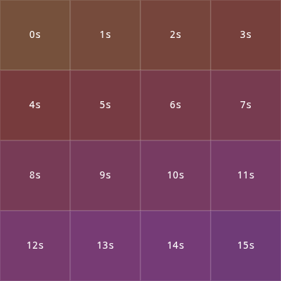

#### timeme 
is floating color timer

The color changes cyclically throughout the day, creating a unique visual timeline. Each second brings a subtle shift in hue, while hours and minutes influence saturation and lightness.

The color progression follows the natural flow of time, creating distinctive visual moments throughout your day.

timeme by yusdesign, 2026
